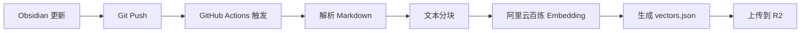
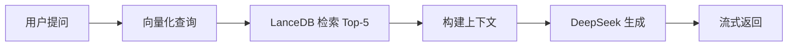

# 个人网站 AI 助手

基于 RAG (Retrieval-Augmented Generation) 的个人知识库 AI 助手，专门了解网站主人的笔记和写作内容。

## 架构设计

```
用户提问 → Q版桌宠UI → /api/chat → 向量检索(LanceDB) → LLM生成(DeepSeek) → 流式返回

Obsidian更新 → GitHub Push → Actions → Embedding(阿里云百炼) → LanceDB → 腾讯云COS存储
```

## 技术栈

### 前端
- **Next.js 16.2** - App Router + Server Components
- **React 19** - 桌宠 UI 组件
- **Framer Motion** - 动画系统（待集成）
- **Tailwind CSS** - 样式

### 后端
- **Vercel Edge Runtime** - 低延迟 API
- **LanceDB** - Serverless 向量数据库
- **腾讯云 COS** - 向量文件存储
- **阿里云百炼** - Text Embedding 模型
- **DeepSeek** - 对话生成模型

### 自动化
- **GitHub Actions** - 自动化 Embedding 生成
- **COS CLI** - COS 文件上传

## 目录结构

```
src/
├── lib/ai/
│   ├── types.ts              # 核心类型定义
│   ├── llm/
│   │   ├── deepseek.ts       # DeepSeek 适配器
│   │   └── factory.ts        # LLM 工厂（支持切换）
│   └── vector/
│       ├── embedding.ts      # 阿里云百炼客户端
│       └── lancedb.ts        # LanceDB 客户端
├── app/api/
│   └── chat/route.ts         # 对话 API (Edge Runtime)
├── components/AIPet/
│   ├── index.tsx             # 桌宠主组件
│   └── AIPetDialog.tsx       # 对话框组件
scripts/
└── build-vectors.mjs         # 向量生成脚本
.github/workflows/
└── generate-vectors.yml      # 自动化工作流
```

## 环境变量配置

复制 `.env.example` 为 `.env.local` 并填入实际值：

```bash
# LLM Provider
LLM_PROVIDER=deepseek

# DeepSeek API
DEEPSEEK_API_KEY=sk-xxxxx

# 阿里云百炼 Embedding
ALIBABA_EMBEDDING_API_KEY=sk-xxxxx

# 腾讯云 COS
COS_SECRET_ID=AKID********************************
COS_SECRET_KEY=********************************
COS_BUCKET=my-web-1347081937
COS_REGION=ap-beijing
COS_PUBLIC_URL=https://my-web-1347081937.cos.ap-beijing.myqcloud.com/vectors
```

## GitHub Secrets 配置

在 GitHub 仓库设置中添加以下 Secrets：

- `ALIBABA_EMBEDDING_API_KEY`
- `COS_SECRET_ID`
- `COS_SECRET_KEY`
- `COS_BUCKET`
- `COS_REGION`

## 使用方法

### 1. 本地开发

```bash
# 安装依赖
npm install

# 配置环境变量
cp .env.example .env.local
# 编辑 .env.local 填入实际值

# 启动开发服务器
npm run dev
```

### 2. 生成向量数据（本地测试）

```bash
# 设置环境变量
export ALIBABA_EMBEDDING_API_KEY=your_api_key

# 运行脚本
node scripts/build-vectors.mjs
```

这会在 `vectors/` 目录生成 `vectors.json` 文件。

### 3. 自动化部署

每次推送 `content/` 目录的更改到 `master` 或 `dev` 分支时，GitHub Actions 会自动：

1. 读取所有 Markdown 文件
2. 生成 Embedding 向量
3. 上传到 Cloudflare R2
4. 更新向量数据库

也可以手动触发：`Actions → Generate Vectors → Run workflow`

## 工作流程

### 数据同步流程



### 对话流程



## API 接口

### POST /api/chat

对话接口，支持流式响应。

**请求体：**
```json
{
  "messages": [
    { "role": "user", "content": "你的兴趣爱好是什么？" }
  ]
}
```

**响应：** Server-Sent Events (SSE)

```
data: {"content":"我"}
data: {"content":"喜欢"}
data: {"content":"编程"}
data: [DONE]
```

## 特性

### ✅ 已完成

- [x] LLM 抽象层（支持模型切换）
- [x] DeepSeek 适配器
- [x] 阿里云百炼 Embedding 集成
- [x] LanceDB 客户端（Serverless 模式）
- [x] 对话 API（流式响应）
- [x] 向量生成脚本
- [x] GitHub Actions 自动化
- [x] 基础桌宠 UI（占位符）
- [x] 对话框组件

### 🚧 待完成

- [ ] 集成真实的 Q 版形象动画
- [ ] 动画状态管理（走路、跑步、打招呼等）
- [ ] LanceDB 真实格式（目前用 JSON）
- [ ] OpenAI / Claude 适配器实现
- [ ] 向量检索优化（混合检索、重排序）
- [ ] 对话历史持久化
- [ ] 用户反馈收集
- [ ] 性能监控与日志

## 下一步计划

1. **集成 Q 版形象动画**
   - 准备关键帧素材
   - 使用 Framer Motion 实现状态切换
   - 添加拖拽功能

2. **优化向量检索**
   - 实现真正的 LanceDB 存储格式
   - 添加混合检索（向量 + 关键词）
   - 实现重排序算法

3. **增强用户体验**
   - 添加打字机效果
   - 支持 Markdown 渲染
   - 添加代码高亮

4. **成本优化**
   - 实现查询缓存
   - 添加频率限制
   - 监控 API 调用量

## 注意事项

1. **API 密钥安全**：不要将 API 密钥提交到 Git
2. **成本控制**：注意 Embedding 和 LLM API 的调用量
3. **Vercel 限制**：注意 Serverless Function 的超时限制（10s/60s）
4. **R2 访问**：确保 R2 bucket 的公开访问权限正确配置

## License

MIT
